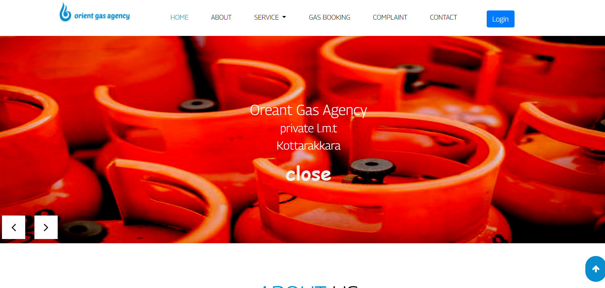

# Orient gas agency 
The project entitled “Orient Gas Agency System” is done to make the manual
process easier by making it a computerized system for helps customers to easily
available of all the services of the gas center.This Web Application helps to
create a computerized system for all manual services like new connection,
Second cylinder, transfer ofownership, change address and gas booking can be
done with the system.

The main advantage of the system is user can view previous gas booking
history, gas cylinder arrival date and time, user applied from status gas agency
is open or close and gas cylinder price

<b>The proposed system divided into three modules:</b>
  

• Admin  
• Home customer  
• Business customer  
<h3>Main Advantage</h3>
The main advantage of the system is listed below. 
1. Customer can apply change address change ownership etc.. 
2. Customer can view previous gas booking history and  book gas cylinder 
3. Customer can view the gas cylinder arrival date and time 
4. Change connected phone number 
5. Customer can apply second cylinder 
6. Customer can view his applied application form status 
7. Customer can easily download/print the transfer termination voucher 
8. Customer can view, the gas agency is open or close 
9. Customer can find the Gas cylinder price 
10. Easy to find a particular customer details 
11. User can send complaint and feedback 
12. Apply new gas connection request 
<h3>User Interface</h3> 

